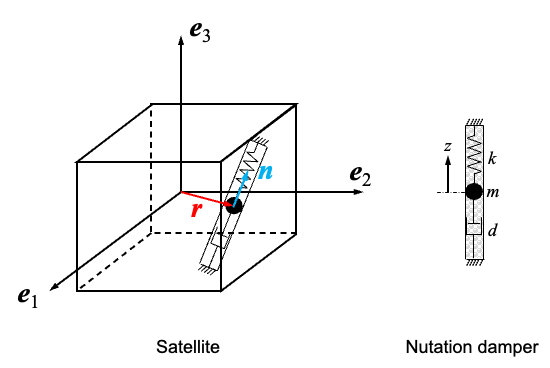

# Nomenclature
$\omega$ : 機体座標系で表した衛星の角速度ベクトル $[\mathrm{rad/s}]$  
$\omega_1, \omega_2, \omega_3$ : $\omega$ の機体座標軸方向の成分 $[\mathrm{rad/s}]$  
$J$ : 可動マスの変位を含む衛星の慣性テンソル $[\mathrm{kg \cdot m^2}]$  
$J^{\ast}$ : $z=0$ における衛星の慣性テンソル $[\mathrm{kg \cdot m^2}]$  
$J_1$, $J_2$, $J_3$ : $J^{\ast}$ の機体座標軸まわりの主慣性モーメント $[\mathrm{kg \cdot m^2}]$  
$m$ : 可動マスの質量 $[\mathrm{kg}]$  
$z$ : 方向 $n$ に沿った可動マスの変位 $[\mathrm{m}]$  
$d$ : ダンパの減衰係数 $[\mathrm{N \cdot s/m}]$  
$k$ : ばね定数 $[\mathrm{N/m}]$  
$r$ : $z=0$ における可動マスの基準位置ベクトル $[\mathrm{m}]$  
$n$ : 可動マスの移動方向を表す単位ベクトル $[-]$  
$I$ : $3\times3$ の単位行列 $[-]$  
$\dot{(\ )}$ : 時間に関する1階微分  
$\ddot{(\ )}$ : 時間に関する2階微分  
$\tilde{a}$ : $\tilde{a}b=a\times b$ を満たすベクトル $a$ の外積行列  
$(\ )^\top$ : ベクトルまたは行列の転置


# 運動方程式
減衰のある衛星の運動方程式の表現の一例として、可動マスをばね・ダンパで接続したモデルを用いる方法がある。



上図に示すように、衛星本体の剛体と、そこに搭載されるニューテーションダンパで構成される。
ニューテーションダンパは $r$ の位置に取り付けられ、 $n$ 方向に自由度を有する。 $n$ 方向の変位を $z$ とする。

このとき衛星の運動方程式は、剛体の運動に加えて、可動マス $m$ が $z$ の変位を有することを考慮して以下のように表記できる[1]。

```math
J \dot{\omega} + \tilde{\omega} J \omega + \dot{J} \omega + m \ddot{z} \tilde{r} n + m \dot{z} \tilde{\omega} \tilde{r} n = 0
```
```math
m\ddot{z} + d \dot{z} + k z - m n^\top \tilde{r} \dot{\omega} + m n^\top \tilde{\omega} \tilde{\omega} (r + z n) = 0 
```
```math
\dot{J} = -m \dot{z} (r n^\top + n r^\top) - 2 m z \dot{z} \tilde{n} \tilde{n}
```


また、 $J$ に関しては、
```math
J = J^* - m z (r n^\top + n r^\top) + m z^2 (n^\top n I - n n^\top) 
```
でありる。ここで、
```math
J^* = \begin{bmatrix} J_1 & 0  & 0 \\ 0  & J_2 & 0 \\ 0 & 0 & J_3 \end{bmatrix}
```
であるので、
$r$, $n$ を用いて計算すると、

```math
J = \begin{bmatrix} J_1 + m z^2 & 0  & 0 \\ 0  & J_2 + m z^2 & -m z \\ 0 & -m z & J_3 \end{bmatrix}
```

となる。つまり、 $J$ は、 $z$ により変化することがわかる。
$\dot{J}$ はこの式を微分すれば求まる。

# Pythonコードにおける運動方程式の解法
上記の運動方程式を数値的に解く。
数値積分には、現在の状態

```math
x=
\begin{bmatrix}
\omega_1 & \omega_2 & \omega_3 & z & \dot z
\end{bmatrix}^{\top}
```

から、その時間微分

```math
\dot{x}=
\begin{bmatrix}
\dot\omega_1 & \dot\omega_2 & \dot\omega_3 & \dot z & \ddot z
\end{bmatrix}^{\top}
```

を求める必要がある。しかし、上記の運動方程式では、未知の角加速度 $\dot \omega$ と可動マスの加速度 $\ddot z$ が互いに結合している。

そこで、$\dot \omega$ と $\ddot z$ を含む項を左辺に集め、それ以外の項を右辺に移す。第1式から、
```math
J\dot\omega+m\tilde r n\ddot z
=
-\tilde\omega J\omega
-\dot J\omega
-m\dot z\tilde\omega\tilde r n
```
を得る。また、第2式から、
```math
-m n^\top\tilde r\dot\omega+m\ddot z
=
-d\dot z-kz
-m n^\top\tilde\omega\tilde\omega(r+zn)
```
が求められる。

これらを組み合わせると、未知量を
```math
q=
\begin{bmatrix}
\dot\omega_1 & \dot\omega_2 & \dot\omega_3 & \ddot z
\end{bmatrix}^{\top}
```
とする4元連立一次方程式
```math
\underbrace{
\begin{bmatrix}
J & m\tilde r n\\
-m n^\top\tilde r & m
\end{bmatrix}}_{A}
\underbrace{
\begin{bmatrix}
\dot\omega\\
\ddot z
\end{bmatrix}}_{q}
=
\underbrace{
\begin{bmatrix}
-\tilde\omega J\omega-\dot J\omega-m\dot z\tilde\omega\tilde r n\\
-d\dot z-kz-m n^\top\tilde\omega\tilde\omega(r+zn)
\end{bmatrix}}_{b}
```
となる。すなわち、各時刻で
```math
Aq=b
```

を解けば、 $\dot{\omega_1}$, $\dot{\omega_2}$, $\dot{\omega_3}$, $\ddot z$ が同時に得られる。

外積行列は 
```math
\tilde{r}^\top = -\tilde{r}
```
を満たすため、

```math
-n^\top\tilde r=(\tilde r n)^\top
```

である。したがって、コードではまず
```python
r_cross_n = r_tilde @ n
```
を計算し、係数行列 $A$ の右上と左下の両方に利用している。

実行例の $r^\top=[0,1,0]$, $n^\top=[0,0,1]$ では、

```math
\tilde r n=r\times n=
\begin{bmatrix}1&0&0\end{bmatrix}^{\top}
```

となるので、係数行列は

```math
A=
\begin{bmatrix}
J_{11} & J_{12} & J_{13} & m\\
J_{21} & J_{22} & J_{23} & 0\\
J_{31} & J_{32} & J_{33} & 0\\
m & 0 & 0 & m
\end{bmatrix}
```

となる。コード中の `coefficient` が $A$、`right_hand_side` が $b$ に対応する。逆行列を明示的に計算する代わりに、
```python
acceleration = np.linalg.solve(coefficient, right_hand_side)
```
によって4つの加速度を求める。その結果と既知の $\dot z$ から `equations_of_motion` が $\dot x$ を返し、`solve_ivp` がそれを時間積分する。


# 実行例
初期状態は以下のように設定されている。
$r^\top = [0, 1, 0]$, $n^\top = [0, 0, 1]$とする。
また、慣性モーメントは、 $J_1 = 2$, $J_2 = 2$, $J_3 = 3$ である。

ニューテーションダンパについては、
$m = 0.1$, $d = 0.02$, $k = 0.1$としている。


# 実行環境
Python 3.9 以上

必要なモジュール
```
import numpy as np
import matplotlib.pyplot as plt
from scipy.integrate import solve_ivp
```

# 参考文献
[1] 木田, システム制御工学シリーズ13 スペースクラフトの制御, コロナ社, pp. 74-76.
